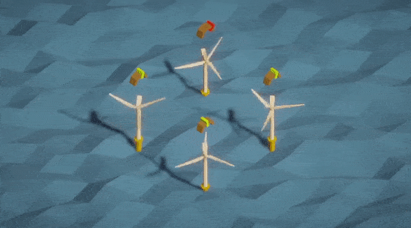

# [Power the Coast](https://github.com/Koltonix/power-the-coast) | [Itchio](https://koltonix.itch.io/power-the-coast)

> Power Turbine maintenance can be a challenging job. If they're too slow they won't produce power, if they're too fast they might explode! Are you up to the task to keep a continuous flow of power to the coast?

# Project Information
- Unity Version 2020.3.21f1
- Blender

# Notes from the Author
The code created for this project was quickly done and in most areas I used shortcuts. Singletons were used. Hard coding was done. But time was saved.